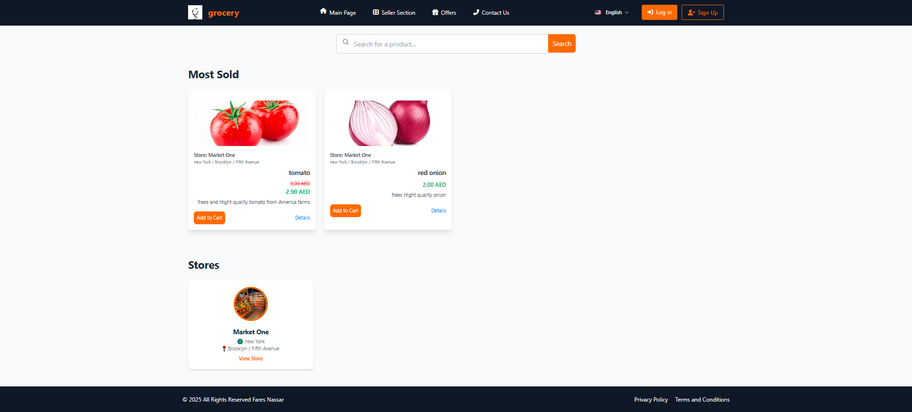

# Grocery E-commerce (Laravel)
 
Multi-vendor e-commerce platform for Users, Sellers, and Admins. Features include persistent cart, multi-store support, product returns, subscriptions via Stripe, tickets, notifications, and full Arabic/English localization.

## 🚀 Features
**User**
- Persistent Cart (DB-based), multiple addresses per user
- Full order lifecycle: open / delivered / returned
- Submit return reasons with email notifications
- Browse products by categories & search
- Subscriptions via Stripe with access control
- Manage personal orders & profile

**Seller**
- Multi-store management
- Add products with multiple images
- Store statistics and sales dashboard

**Admin**
- Manage tickets (chat-like) with attachments
- Manage Users,Seller,Products,Orders,Areas,cities categories and stores

## 🧰 Tech Stack
Laravel, Livewire, MySQL/PostgreSQL, Filament, Stripe, Mail, Localization (English & Arabic), Logging

## 📂 Project Structure

app/ ->
Services/ → Business logic
Policies/ → Access control

resources/
views/ → Blade templates

routes/
web.php → Web routes

docs/
screenshots/ → Project images

## 📸 Screenshots
See `/docs/screenshots/` for:
- Cart & Checkout
- Seller Dashboard
- Tickets System

## 🛠 Installation & Usage
**Requirements**
- PHP 8.2+
- Composer
- MySQL

**Setup**
cp .env.example .env
# Fill DB_*, MAIL_*, STRIPE_* keys
composer install
php artisan key:generate
php artisan migrate
php artisan storage:link
php artisan serve

| Role   | Email            | Password |
| ------ | ---------------- | -------- |
| User   | user@test.com    | 00000000 |
| Seller | seller@test.com  | 00000000 |
| Admin  | admin@test.com   | 00000000 |

Website: https://lightgray-chinchilla-755244.hostingersite.com/
Admin Panel: https://lightgray-chinchilla-755244.hostingersite.com/admin/login

